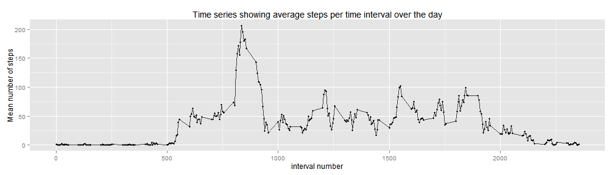
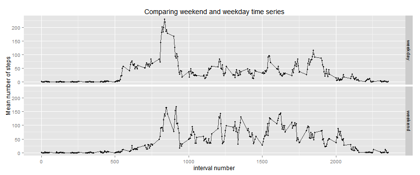

Introduction
===============
Pre loading required libraries

```r
library(ggplot2)
library(lubridate)
library(dplyr)
library(xtable)
library(gridExtra)
```

Downloading, extracting and reading the data into a data frame called "data" and changing the date variable to a date format.   
Note: The time and date of the download: 2015-08-07 14:20:54 BST (or GMT depending on time of year)

```r
url = "http://d396qusza40orc.cloudfront.net/repdata%2Fdata%2Factivity.zip"
download.file(url, "data.zip")
unzip("data.zip")
data <- read.csv("activity.csv")
data$date <- as.Date(data$date)
```


#####The variables included in this data set are:  
- **steps:** Number of steps taken in a 5-minute interval (missing values are coded as NA)  
- **date:** The date on which the measurement was taken in YYYY-MM-DD format  
- **interval:** Identifier for the 5-minute interval (time of day) in which measurement was taken.   

What is the mean total number of steps taken per day?
============================================================================================

For this initial analysis missing data is ignored, a comparison is made between this and imputed data later.   
In order to analyse/explore the total steps taken per day, first the raw data must be reformatted, summarising the total steps taken per day.  
This is done by first grouping the data by date, then summing the total steps taken from each observation in that date. The resulting data frame has two variables:

+ **date:** The date on which the measurement was taken in YYYY-MM-DD format    
+ **steps:** The total steps taken on that day. 


```r
daily.steps <- group_by(data, date) %>%
  summarise(total.steps = sum(steps))
```

The summary statistics for this data is given, showing the quartiles and mean of total steps taken per day:  

```r
summary(daily.steps$total.steps)
```

```
##    Min. 1st Qu.  Median    Mean 3rd Qu.    Max.    NA's 
##      41    8841   10760   10770   13290   21190       8
```

Using this data we can plot a histogram showing how total steps taken per day varies.  
A bin width of 2000 was chosen to improve the number of meaninful frequencies (small frequency counts give high uncertainty) while keeping a clear shape.   

```r
plot1 <- ggplot(daily.steps, aes(total.steps)) +
  geom_histogram(binwidth=2000, fill="darkblue") +
  labs(y = "Frequency") +
  labs(x = "Total steps per day") +
  labs(title = "Histogram of steps taken per day") + 
  theme(plot.title=element_text(vjust=2)) +
  theme(axis.title.y=element_text(vjust=1)) +
  theme(axis.title.x=element_text(vjust=-0.5)) +
  scale_x_continuous(breaks=seq(1000, 25000, 4000)) +
  ylim(0,18) +
  xlim(0, 23000)
```

```
## Scale for 'x' is already present. Adding another scale for 'x', which will replace the existing scale.
```

```r
plot1
```


What is the average daily pattern
============================================================================================
In order to explore the average daily pattern for steps taken, first the raw data must be reformatted, summarising the average steps taken for that time interval each day. Note for this analysis missing data is ignored.  

This is done by first grouping the data by interval and then calculating the mean number of steps for each interval group. The resulting data frame has two variables:

+ **interval:**  Identifier for the 5-minute interval (time of day) in which measurement was taken.
+ **mean.steps:** The average number of steps taken in that 5 minute interval. 


```r
interval.steps <- group_by(data, interval) %>%
  summarise(mean.steps = mean(steps, na.rm=T))
```
The summary statistics of this data is given below, showing the maximum number of steps taken as 206.1698113 at interval 104

```r
summary(interval.steps$mean.steps)
```

```
##    Min. 1st Qu.  Median    Mean 3rd Qu.    Max. 
##   0.000   2.486  34.110  37.380  52.830 206.200
```

```r
which.max(interval.steps$mean.steps)
```

```
## [1] 104
```

Using this data we can plot how the activity (number of steps) changes with time over the day. 

```r
ggplot(interval.steps, aes(interval, mean.steps)) +
  geom_point(size=2, shape=20) +
  geom_line(alpha=0.7) +
  labs(y = "Mean number of steps") +
  labs(x = "interval number") +
  labs(title = "Time series showing average steps per time interval over the day")
```

 

Imputing Missing Values
============================================================================================

When analysing the data you can see that there is a number of NA values for steps (but date and interval information is complete). 

```r
sapply(data, function(x) sum(is.na(x)))
```

```
##    steps     date interval 
##     2304        0        0
```

We can see below that the NA values are confined to whole days where every observation is missing, this means we cannot use mean values for those days to help impute the NA values. Instead we can rely on the interval data and also use the day of the week as a factor (missing values are spread quite evenly through the days of the week; 0-2 days missing for each day of the week).

```r
group_by(data, date) %>%
  summarise(NAs = sum(is.na(steps)), notNA = sum(!is.na(steps)))
```

Source: local data frame [61 x 3]

         date NAs notNA
1  2012-10-01 288     0
2  2012-10-02   0   288
3  2012-10-03   0   288
4  2012-10-04   0   288
5  2012-10-05   0   288
6  2012-10-06   0   288
7  2012-10-07   0   288
8  2012-10-08 288     0
9  2012-10-09   0   288
10 2012-10-10   0   288
..        ... ...   ...

To impute the missing data we will replace NA values with the mean for its interval value and multiply this by a normalised mean for that day of the week (which represents how many times the average that day of the week is). The steps to do this are as follows:  

+ First calculate the day of the week to add as a factor variable to the raw data. 
+ Then grouping the data by the day of the week and calculating the mean number of steps for those days, normalising this value (so we have values that represent how many times more than average that day of the week is). 
+ Finally going through each row of the data we replace NA values with the mean of that intverval multiplied by the normalised mean of that weekday. 

```r
# Add day labels to raw data
imputed.data <- mutate(data, day = wday(date, label=TRUE))

# Calculate normalised mean steps for each day of the week
weekday.steps <- group_by(imputed.data, day) %>%
  summarise(mean.steps = mean(steps, na.rm=T)) %>%
  mutate(norm.mean = mean.steps / mean(imputed.data$steps, na.rm=T))

# Loop through rows of data replacing NA values with interval mean * normalised weekday mean
for (i in 1:nrow(imputed.data)) {
  if (is.na(imputed.data[i, "steps"])) {
    imputed.data[i, "steps"] = interval.steps$mean.steps[which( interval.steps$interval == imputed.data[i, "interval"])] *
      weekday.steps$norm.mean[which( weekday.steps$day == imputed.data[i, "day"])]     
  }
}
```
###Analysing Imputed data

Using this imputed data we can recalculate total steps taken per day and compare with our previous results. 

```r
imputed.daily.steps <- group_by(imputed.data, date) %>%
  summarise(total.steps = sum(steps))

# Calculate summary statistics for imputed data
summary(imputed.daily.steps$total.steps)
```

```
##    Min. 1st Qu.  Median    Mean 3rd Qu.    Max. 
##      41    8918   11020   10820   12810   21190
```
The mean has not changed significantly incresing from 1.077 &times; 10<sup>4</sup> to 1.082 &times; 10<sup>4</sup> a increase of 0.4642526%  
The median has changed more signifficantly increasing from from 1.076 &times; 10<sup>4</sup> to 1.102 &times; 10<sup>4</sup> a increase of 2.4163569%  

We can replot the histogram of total daily steps to see where these extra days have been binned. 

```r
plot3 <- ggplot(imputed.daily.steps, aes(total.steps)) +
  geom_histogram(binwidth=2000, fill="darkblue") +
  labs(y = "Frequency") +
  labs(x = "Total steps per day") +
  labs(title = "Imputed data") + 
  theme(plot.title=element_text(vjust=2)) +
  theme(axis.title.y=element_text(vjust=1)) +
  theme(axis.title.x=element_text(vjust=-0.5)) +
  scale_x_continuous(breaks=seq(1000, 25000, 4000)) +
  ylim(0,18) +
  xlim(0, 23000)
```

```
## Scale for 'x' is already present. Adding another scale for 'x', which will replace the existing scale.
```

```r
grid.arrange(plot1, plot3, ncol=2)
```


We can see above that the imputed NA values cluster around the ~9000 steps and ~13000 steps bucket. In total not affecting the mean too much but pushing up the median. Only one of the missing days has been binned in the most frequent bucket. 

Are there differences in activity patterns between weedays and weekends?
=================================================================================
To compare activity patterns between weekdays and weekends, we will create two time series from weekday and weekend measurements, averaging steps for each interval over all weekday daya or weekend days. 

To do this first seperate out the data into weekday and weekend measurements by creating a new factor variable with two levels "weekday" and "weekend" based on the "day" factor variable.


```r
imputed.data <- mutate(imputed.data, weekend = ifelse(day == "Sat" | day == "Sun", "weekend", "weekday")) 
```
As before we group the data by interval but also by the binary weekend/weekday variable. 

```r
imputed.interval.steps <- group_by(imputed.data, interval, weekend) %>%
  summarise(mean.steps = mean(steps, na.rm=T))
```
We can then plot the activity time series for both weekend and weekday activity and compare their characterisics:

```r
ggplot(imputed.interval.steps, aes(interval, mean.steps)) +
  facet_grid(weekend~.) +
  geom_point(size=2, shape=20) +
  geom_line(alpha=0.7) +
  labs(y = "Mean number of steps") +
  labs(x = "interval number") +
  labs(title = "Comparing weekend and weekday time series")
```

 
Interesting characteristics shown:  

+ Weekday steps start earlier in the day implying an earlier waking time. 
+ The spike in activity at interval ~ 800 is larger during the weekday. 
+ General activity after that spike is higher during the weekend than weekday. 
+ Activity on the weekend continues later than during the weekday. 
